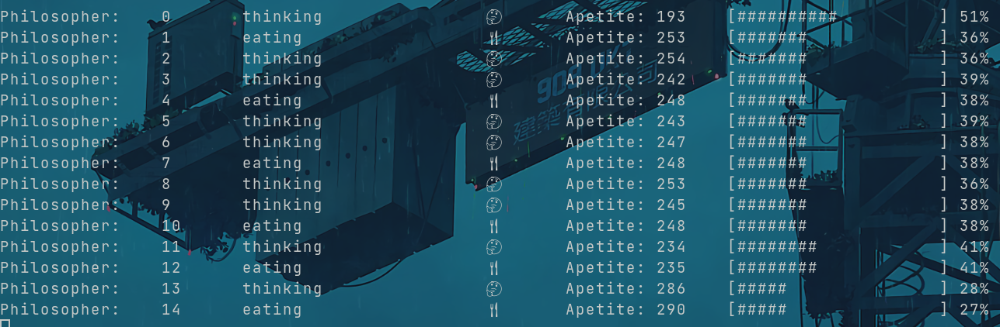

# Dining Philosophers

This is my golang-implementation of my solution to the dining philosopher's problem assigned to me in CSC-345. This solution makes use of golang's excellent concurrency features. This is by far the best and simplest solution that I've made thus far. I suggest anyone give Go a try.

## Visualizer

Unlike my other solutions to this problem, in this attempt, I've managed to create a visualizer for the progress of the philosophers. An improvement I'd like to make to the visualizer would be to make the progress bar resize based on the size of the terminal it's being ran in.

## Other Solutions

- [Rust](https://github.com/JingusJohn/dining_philosophe_rs)
- [C](https://github.com/JingusJohn/dining-philosophers/tree/main)

